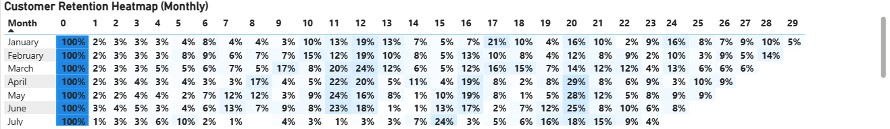
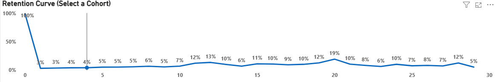
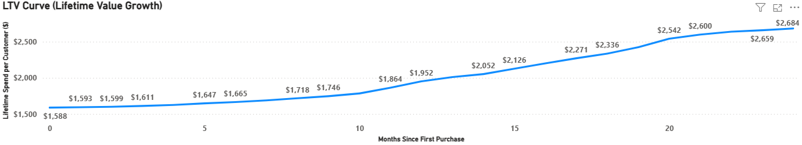

# 📊 Customer Cohort Retention & Lifetime Value Analysis  
### SQL | Power BI | Cohort Analysis + LTV Modeling  

---

📌 A data analytics project measuring **customer retention and lifetime value growth** using SQL + Power BI.

---

## 🔍 Project Overview

This project analyzes customer behavior over time using **Cohort retention modeling** and **LTV curve analysis**.

It tracks:

✔ How customer cohorts perform over months  
✔ When churn happens  
✔ How much value returning customers contribute  

The outcome is a Power BI dashboard showing retention patterns and lifetime value progression.

---

## 🧠 Business Questions Answered

- How many customers return after their first purchase?
- What percentage of users return after 1–12+ months?
- Which monthly cohorts are the strongest performers?
- What is the **average retention rate across cohorts?**
- How does **lifetime value evolve** over time?

---

## 🛠 Tools & Technologies Used

| Component       | Technology            |
|----------------|------------------------|
| Data storage   | PostgreSQL            |
| Transformations | SQL Views / CTEs      |
| Visualization  | Power BI              |
| Language       | SQL + DAX (minor)     |

---

## 🗂 Dataset & Data Model

### Key fields used:

- `customer_id`
- `order_date`
- `revenue`
- `cohort_month`
- `period_number`
- `customers_in_period`
- `lifetime_value`

## 📂 Data Model Flow

vw_sales  
    ↓  
vw_customer_first_purchase  
    ↓  
vw_cohort_activity  
    ↓  
vw_cohort_retention_pct  
vw_cohort_ltv  
    ↓  
Power BI Dashboard

---

## 📁 Project Structure

📦 Screenshots             → Power BI dashboard images  
📄 cohort_analysis.sql     → SQL logic for cohort, retention & LTV modeling  
📄 cohort_dashboard.pbix   → Power BI dashboard file  
📄 README.md               → Full project documentation

---

## 📊 Dashboards Included

✔ Cohort Retention Heatmap  
✔ Retention Trend Curve  
✔ Customer Lifetime Value Curve  
✔ Average Retention KPI Card

---

## 🧮 SQL Logic

This project is driven mainly by SQL. The `cohort_analysis.sql` script includes:

- **Cohort assignment**  
  - Identifies each customer's first purchase date  
  - Groups customers into monthly cohorts using `cohort_month`

- **Cohort activity & period calculation**  
  - Calculates `period_number` = months since first purchase  
  - Tracks when customers return after joining

- **Retention calculation**  
  - Counts distinct active customers per cohort and period  
  - Computes `retention_pct` = customers_in_period / cohort_size

- **Lifetime value (LTV) modeling**  
  - Aggregates revenue by cohort and period  
  - Builds `cumulative_revenue`  
  - Derives `avg_ltv_per_customer` over time

📄 All logic is contained in: `cohort_analysis.sql`

---

## 🚀 How to Run This Project

### 🔹 Step 1 — Load SQL Logic
Run `cohort_analysis.sql` in PostgreSQL to generate:

- cohort assignment view  
- retention calculation view  
- lifetime value (LTV) view  

### 🔹 Step 2 — Refresh Power BI Data
Connect Power BI to your database and load:

- `vw_cohort_retention_pct`
- `vw_cohort_ltv`

### 🔹 Step 3 — Explore Dashboard
Open `cohort_dashboard.pbix` to view:

- retention heatmap  
- trend curves  
- KPI metrics  

You can interact with visuals to review patterns, compare cohorts, and interpret customer value behavior.

---

## 🖼 Dashboard Screenshots

📌 **Retention Heatmap**  
  

📌 **Retention Trend Curve**  
 

📌 **Lifetime Value (LTV) Curve**  
  

📌 **Full Dashboard View**  

 ---

 ## 🔎 Key Insights & Findings

✔ **Early churn is high** — most customers disengage after their first month  
✔ A smaller loyal segment continues returning beyond month 6  
✔ **Average retention averages around ~17%**, indicating a repeat customer core  
✔ Retention spikes around **months 10–12**, suggesting reactivation or seasonal behavior  
✔ **Lifetime value steadily grows**, reaching ~$2,600+ per retained customer  
✔ Cohorts improve over time — newer cohorts show stronger spend accumulation  

➡ These insights help businesses understand user loyalty, identify reactivation opportunities, and forecast long-term customer value.

---

## 📬 Contact

If you’d like to connect, collaborate, or discuss analytics work — feel free to reach out:

🔗 **LinkedIn:** https://www.linkedin.com/in/dataanalystshohag/  
🔗 **GitHub:** https://github.com/Shohag-DataAnalyst

💬 Open to opportunities in data analytics, dashboarding, SQL modeling, and BI reporting.

